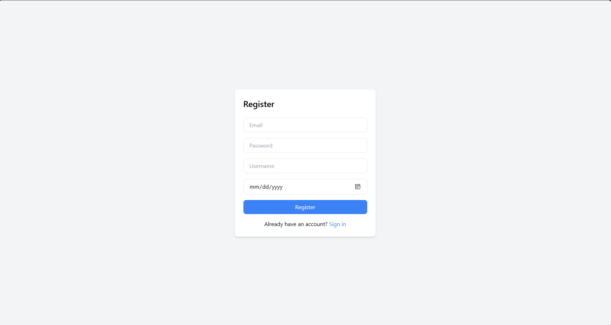

# Task-2-FE

This project was bootstrapped with [Create React App](https://github.com/facebook/create-react-app).

## Available Scripts

In the project directory, to install all the dependencies you can run:

```
npm install
```
Runs the app in the development mode:
```
npm start
```

Open [http://localhost:3000](http://localhost:3000) to view it in your browser.

## Screens
### 1. Login Page


### 2. Sign up Page



### 3. Home Page
- Can edit username, birthdate
- Search by username, email


## Caution
> Sometimes, when the backend server is slow, please check the requests using the DevTools.

## Deployed website
```

```
